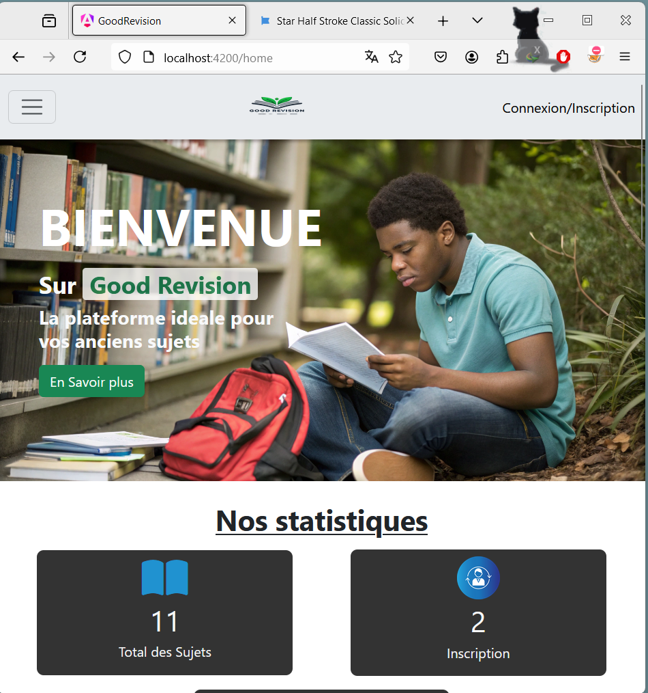
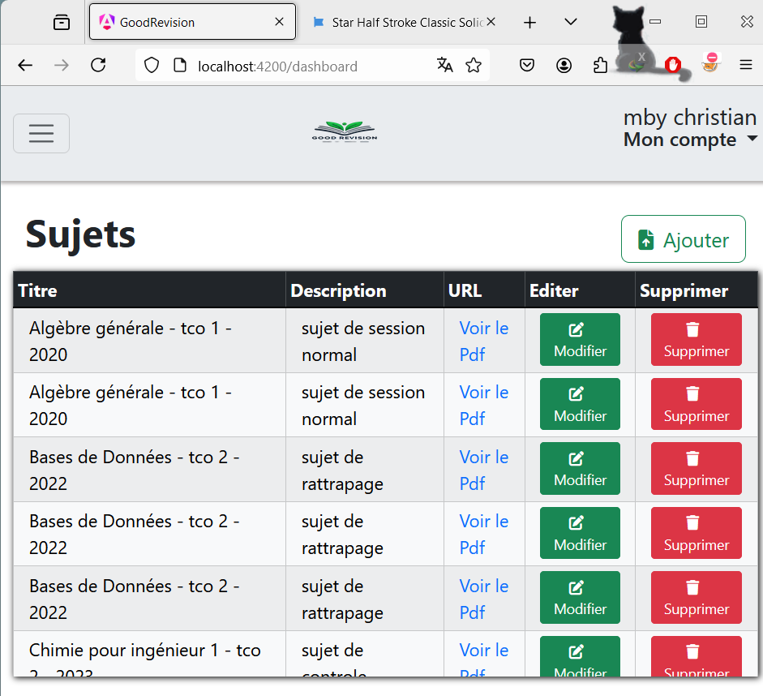
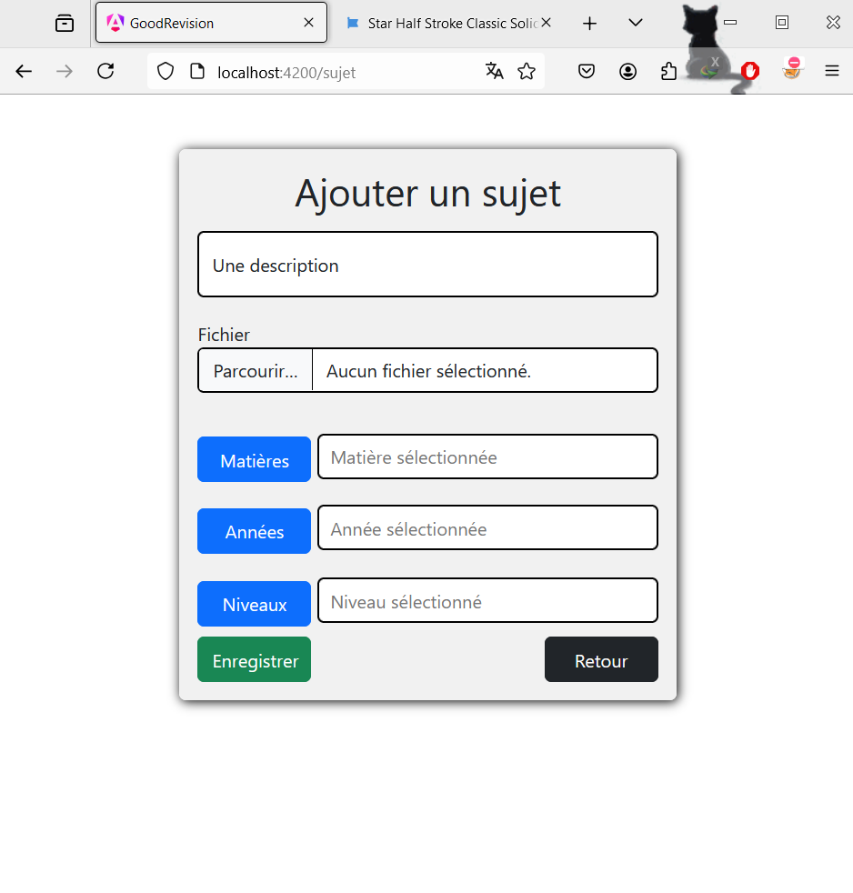

# Good Révision Platform

Good Révision is a platform developed with Spring Boot and Angular.  
It aims to facilitate access to old exam papers for students, allowing them to better prepare for their academic assessments.  
The project solves the problem of dispersion of old papers by offering a centralized point for their consultation.  
Users can search for papers by subject, year, or level, download the papers, and administrators have the ability to manage the resources available on the platform.

## Table of Contents

- [Frontend Screenshots](#Frontend-Screenshots)
- [Prerequisites](#Prerequisites)
- [Setup](#Setup)
- [Running the Application](#Running-the-Application)
- [Technologies Used](#Technologies-Used)


---
## Frontend Screenshots
### Home

### Dashboard 

### Add subject


## Prerequisites

Before you begin, make sure you have the following installed on your computer:

- Java 17
- Maven
- Node.js , npm et Angular CLI (pour Angular)
- Bootstrap
- fontawesome
- MySQL
- Postman (optionnel, pour tester les API)

---

## Setup

### Backend (Spring Boot)

1. Clone the repository :
   ```bash
   https://github.com/mbyChristian/good-revision-repo.git
   
2.  Create a MySQL database :
```
CREATE DATABASE good_study_db
```

3.  Configure the database connection

Open directory `\backend\src\main\resources\application.properties` and configure the following properties with your MySQL credentials:

```
spring.datasource.url=jdbc:mysql://localhost:3306/good_study_db
spring.datasource.username=<your_user>
spring.datasource.password=<your_user_password>
spring.datasource.driver-class-name=com.mysql.cj.jdbc.Driver
spring.jpa.hibernate.ddl-auto=update
spring.jpa.show-sql=true
spring.jpa.properties.hibernate.dialect=org.hibernate.dialect.MySQLDialect
```
4. install dependencies and build the project:
```
mvn clean install

```
## Running the Application
### Start the Backend
   1. Go back to the `backend` folder and start the Spring Boot application
```
   mvn spring-boot:run
```
   2. The backend will be accessible at: `http://localhost:9000`

### Start the Frontend

1. Run the following command to install Angular CLI globally on your machine
```
   npm install -g @angular/cli
```
2. install dependencies

```
   npm install
```

3. From the `frontend` folder, launch the Angular server :
```
   ng serve
```
4. The frontend will be accessible at: `http://localhost:4200`

##  Technologies Used
- Backend : Spring Boot, MySQL
- Frontend : Angular, TypeScript, Bootstrap, fontawesome
- Tools : Postman, Git, Maven, Node.js

